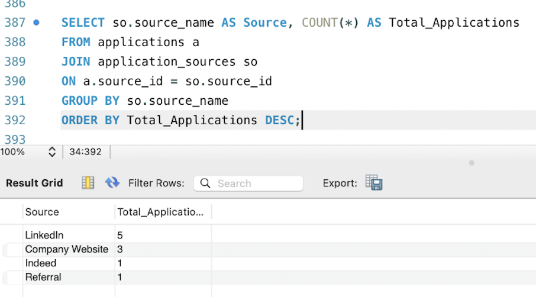
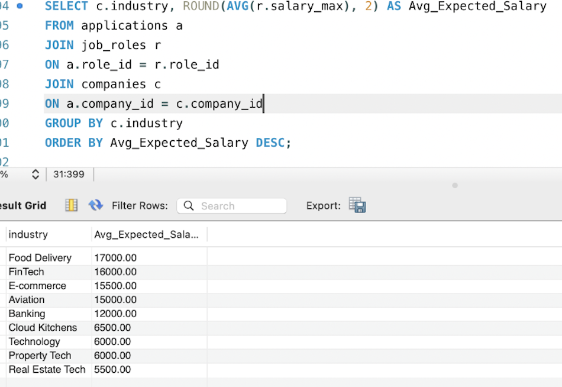
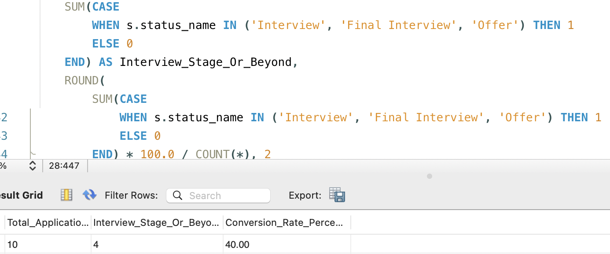

# Job Application Tracker Database

An advanced SQL portfolio project that models a real-world job application tracking system and provides data-driven insights from application activity.

---

## 📌 Project Overview

This project simulates a realistic workflow for managing internship and job applications.  
It tracks companies, roles, statuses, interviews, follow-ups, and skills while supporting analysis through SQL queries.

The goal is to move beyond simple CRUD operations and demonstrate real analytical thinking using SQL.

---

## ⚙️ Features

- Relational database schema with multiple linked tables
- Application tracking by company, role, and status
- Interview stage management
- Follow-up tracking
- Skill mapping for job roles
- Analytical queries for real insights
- Summary view for reporting

---

## 🗄️ Database Tables

- `users`
- `companies`
- `job_roles`
- `application_statuses`
- `application_sources`
- `applications`
- `interviews`
- `follow_ups`
- `skill_tags`
- `role_skills`

---

## 🧠 SQL Concepts Demonstrated

- Table creation & schema design  
- Primary & foreign keys  
- One-to-many & many-to-many relationships  
- `JOIN`  
- `GROUP BY`  
- `ORDER BY`  
- `AVG`, `COUNT`, `SUM`  
- `CASE WHEN`  
- Views  
- Business logic filtering  

---

## 📊 Data Analysis & Insights

### 1. Application Overview
A complete view of all applications including company, role, status, source, and salary expectations.

---

### 2. Applications by Source
Shows which platforms generated the most applications.

**Insight:** LinkedIn is the primary source of applications.

---

### 3. Average Salary by Industry
Compares expected salaries across industries.

**Insight:** Food Delivery and FinTech roles have the highest average salary expectations.

---

### 4. Highest Paying Roles
Lists roles sorted by maximum expected salary.

**Insight:** Product Analyst and SQL Developer roles offer the highest salaries in this dataset.

---

### 5. Conversion Rate Analysis
Measures how many applications reach interview stage or beyond.

**Insight:**  
40% of applications progressed to interview stage or further.

---

## 📁 Files

- `job_application_tracker.sql` — full database schema, seed data, and analysis queries

---

## ▶️ How to Run

1. Open MySQL Workbench or any SQL environment  
2. Run the full `job_application_tracker.sql` script  
3. Execute the queries section  
4. Use results for analysis and insights  

---

## 🚀 Key Takeaway

This project demonstrates how SQL can be used not just for storing data, but for extracting meaningful insights from real-world scenarios like job application tracking.
